# Real-Time E-Commerce & Sales Forecasting

> An end-to-end real-time streaming pipeline ingesting mock e-commerce transactions into an Azure Data Lakehouse. Transformed via the **Medallion Architecture** using PySpark Structured Streaming and compiled for analytics — serving actionable insights directly to Real-time Dashboards.

---

## Executive Summary

- **Real-Time Streaming Architecture:** Processes continuous, high-volume e-commerce events via Azure Event Hubs (Kafka protocol) into structured Medallion containers (Bronze/Silver/Gold).
- **Robust Micro-Batching:** Implements PySpark Structured Streaming with strict windowing and trigger configurations, enabling fail-safe execution and exactly-once processing guarantees.
- **Data Quality & Transformation:** Embedded PySpark logic automatically flattens complex JSON payloads, casts data types, and filters invalid records before aggregation.
- **Analytical Deep-Dives:** Engineered real-time semantic aggregations—including tumbling window calculations for sales revenue and item counts grouped by geographic regions.

---

## 1. Project Overview

| Item                        | Detail                                                                                               |
| --------------------------- | ---------------------------------------------------------------------------------------------------- |
| **Purpose**           | Ingest, cleanse, and transform streaming e-commerce transactions into real-time business KPIs        |
| **Data Source**       | Mock JSON payload generator simulating live e-commerce orders (customer, product, price, location)   |
| **Scale**             | Continuous streaming events processed in 60-second micro-batches                                     |
| **Output**            | Gold layer KPIs →**1 Interactive Real-time Dashboard** (Sales Analytics & Geographic Mapping) |
| **Streaming Engine**  | Azure Event Hubs (Apache Kafka compatibility)                                                        |
| **Processing Engine** | Azure Databricks (PySpark Structured Streaming)                                                      |
| **Data Lake**         | Azure Data Lake Storage Gen2 (Delta Format)                                                          |

---

## 2. Architecture & Tech Stack

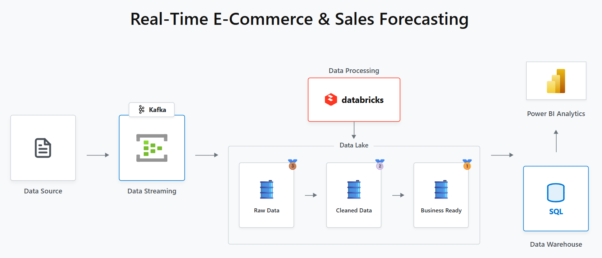

### Tech Stack

| Category                    | Technology                 | Role                                         |
| --------------------------- | -------------------------- | -------------------------------------------- |
| **Data Source**       | Python (Faker)             | Origin of simulated e-commerce transactions  |
| **Data Streaming**    | Azure Event Hubs (Kafka)   | Ingesting high-throughput streaming events   |
| **Processing Engine** | Azure Databricks (PySpark) | Core transformation via Structured Streaming |
| **Cloud Storage**     | ADLS Gen2                  | Immutable Delta tables (Bronze/Silver/Gold)  |
| **Data Warehouse**    | Databricks SQL Warehouse   | Gold layer serving and external querying     |
| **BI & Serving**      | Power BI / Web Dashboard   | Interactive real-time analytics              |

### Design Rationale

- **Event-Driven Microservices**: Utilizing Azure Event Hubs with the Kafka protocol ensures decoupling of the data producer from the processing engine, handling massive spikes in traffic effortlessly.
- **PySpark Structured Streaming**: Handles continuous data streams natively. Enforces rigid schema definitions upon reading and writes ACID-compliant Delta tables.
- **Medallion Architecture**: Progressively improves data structure and quality, allowing different teams (Data Scientists, BI Analysts) to query the appropriate layer without impacting upstream processes.

---

## 3. Data Model

### Container Layout

Both Raw and Processed sources share standard containers within ADLS Gen2, isolated fundamentally via `bronze/`, `silver/`, and `gold/` directory paths.

### 🥉 Bronze Layer

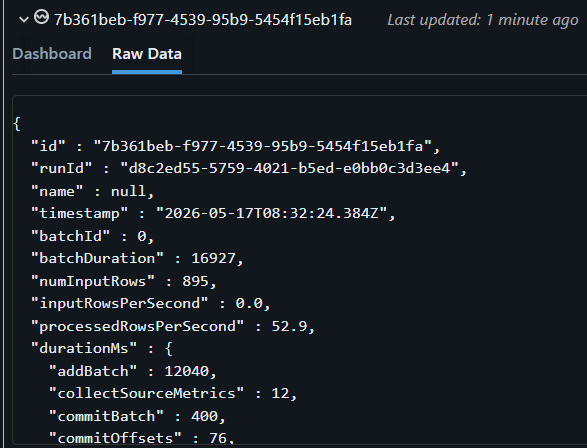
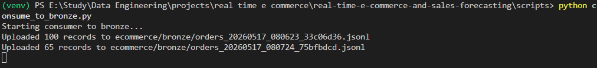

- **Ingestion**: Extracts raw JSON payload strings and Kafka metadata directly into Delta format.
- **Data Exploration**:
  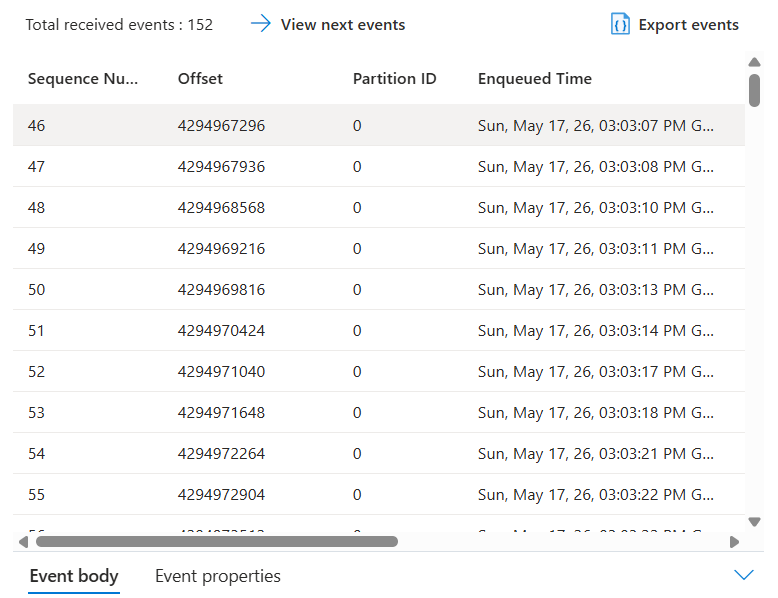
- **Output**:
  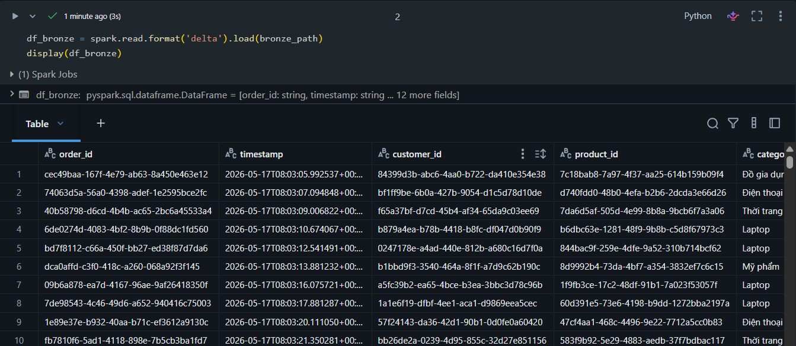

### 🥈 Silver Layer

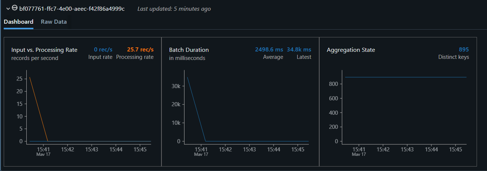

- **Transformation**: Parses the raw JSON string into rigid column structures using `from_json()`.
- **Data Quality**: Casts correct data types (e.g., `price` to Double, `quantity` to Integer) and flattens nested geographic data (`city_province`, `region`).
- **Output**:
  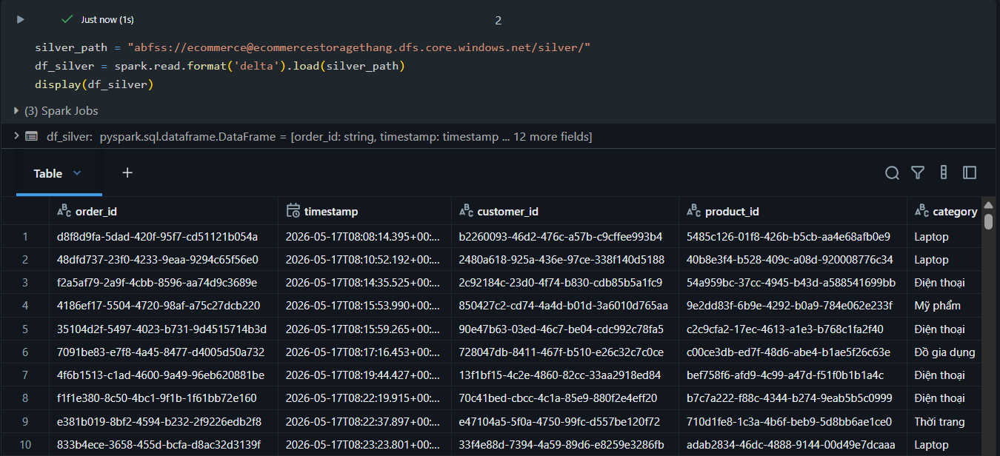

### 🥇 Gold Layer

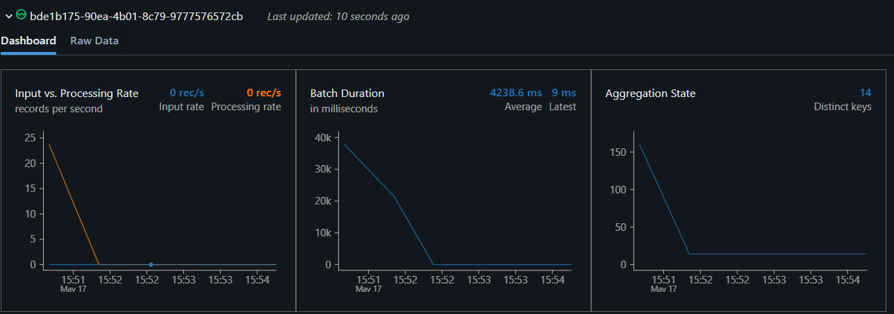

- **Aggregations**: Groups data by `city_province`, `region`, and 1-minute `window` slices.
- **Metrics**: Calculates `total_items` (Sum) and `total_sales` (Sum) for the real-time dashboard.
- **Output**:
  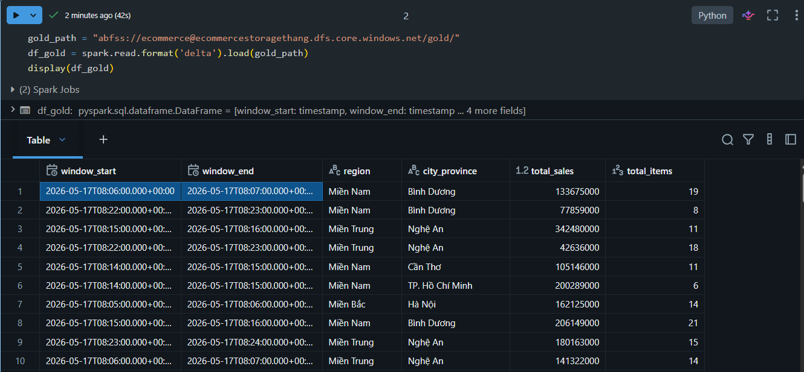

---

## 4. Streaming Implementation

### Workflow Snippets

All transformations reside in PySpark notebooks leveraging `readStream` and `writeStream`.

```python
# Silver to Gold Aggregation Snippet
gold_streaming_df = silver_df \
    .withWatermark("timestamp", "1 minute") \
    .groupBy(
        window(col("timestamp"), "1 minute"),
        col("city_province"),
        col("region")
    ) \
    .agg(
        sum("quantity").alias("total_items"),
        sum("total_amount").alias("total_sales")
    )

gold_streaming_df.writeStream \
    .format("delta") \
    .outputMode("append") \
    .option("checkpointLocation", f"{mount_point}/checkpoints/gold") \
    .start(f"{mount_point}/gold/gold_orders_aggregated")
```

### Triggering the Pipeline

1. **Producer**: Execute `python stream_orders.py` to begin pushing simulated transactions to Event Hubs.
   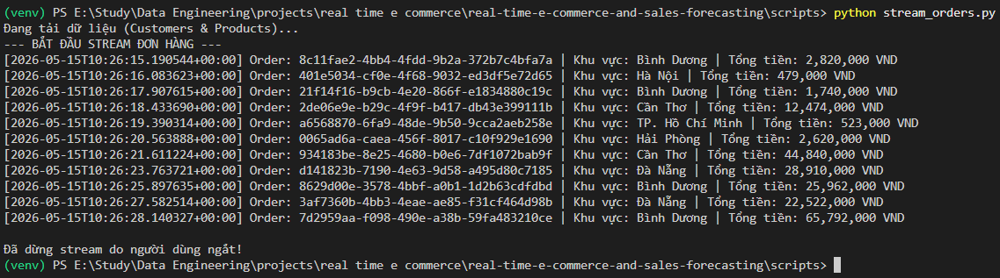
2. **Databricks Jobs**: Run the notebooks sequentially to start the micro-batch processing.
   - `stream_eventhub_to_bronze`
   - `stream_bronze_to_silver`
   - `stream_silver_to_gold`

---

## 5. Power BI Dashboard

> 🔗 **Live Interactive Dashboard:** [View on Power BI Service](https://app.powerbi.com/view?r=eyJrIjoiZDhhMzllNmEtYzdlZi00N2FmLWE4NjMtMDllMWE3Mjk3MTkwIiwidCI6IjZhYzJhZDA2LTY5MmMtNDY2My1iN2FmLWE5ZmYyYTg2NmQwYyIsImMiOjEwfQ%3D%3D)

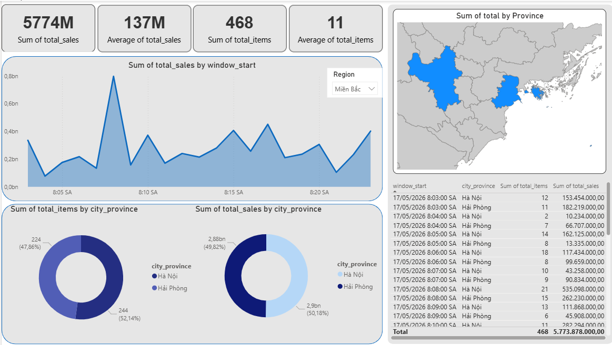

- **KPI Metrics**: Total Sales Revenue, Average Order Value, Total Items Sold, Active Provinces.
- **Geographic Mapping**: Interactive Map of Vietnam visualizing revenue intensity by province.
- **Trend Analysis**: Tumbling window Area Chart tracing total sales over time.
- **Categorical Breakdown**: Donut charts detailing the proportion of sales and items by regional distribution.

---

## 6. Folder Structure

```text
real-time-e-commerce-and-sales-forecasting/
├── databricks/
│   ├── stream_eventhub_to_bronze.py     # Kafka consumer to Bronze Delta
│   ├── stream_bronze_to_silver.py       # JSON parsing & type casting
│   └── stream_silver_to_gold.py         # Windowed aggregations
├── scripts/
│   ├── stream_orders.py                 # Python Kafka Producer (Faker)
│   └── consume_to_bronze.py             # Event Hub batch consumer
├── plan/
│   ├── pipeline.html                    # Architecture diagram source
│   ├── dashboard.html                   # Real-time Web Dashboard (Power BI equivalent)
│   ├── dashboard.css                
│   └── dashboard.js                 
├── images/                              # Project documentation assets
├── .env.example                         # Environment configuration template
└── README.md
```

---

## 7. How to Run

### Prerequisites

Before running the pipeline, ensure you have:

- **Python 3.8+** installed locally.
- An active **Azure Subscription**.
- An **Azure Event Hubs** namespace configured with a Kafka-enabled Hub named `ecommerce-orders`.
- An **Azure Storage Account** with a container named `ecommerce` to act as the Data Lakehouse storage.
- An **Azure Databricks** Workspace configured with access to the Azure Storage Account (using ADLS Gen2 Account Key or Service Principal).

### Setup Environment Variables

Clone the repository and create a `.env` file in the root directory by copying the example template:

```bash
cp .env.example .env
```

Open `.env` and fill in your Azure Event Hubs and Azure Storage credentials:

```ini
# Kafka / Azure Event Hubs Configuration
BOOTSTRAP_SERVERS='<your-eventhub-namespace>.servicebus.windows.net:9093'
EVENT_HUB_CONNECTION_STRING='Endpoint=sb://<your-eventhub-namespace>.servicebus.windows.net/;SharedAccessKeyName=RootManageSharedAccessKey;SharedAccessKey=<your-key>'
EVENT_HUB_NAME='ecommerce-orders'
EVENT_HUB_NAMESPACE='<your-eventhub-namespace>.servicebus.windows.net'

# Azure Blob Storage (Bronze Layer)
AZURE_STORAGE_CONNECTION_STRING='DefaultEndpointsProtocol=https;AccountName=<your-storage-name>;AccountKey=<your-storage-key>;EndpointSuffix=core.windows.net'
AZURE_CONTAINER_NAME='ecommerce'

# Azure Data Lake Storage Gen2 (for Databricks)
STORAGE_ACCOUNT_NAME='<your-storage-name>'
STORAGE_ACCOUNT_ACCESS_KEY='<your-storage-key>'
```

### Install Local Dependencies

Create a virtual environment and install the required Python packages:

```bash
# Create and activate virtual environment
python -m venv venv
source venv/bin/activate  # On Windows: venv\Scripts\activate

# Install dependencies
pip install kafka-python pandas python-dotenv azure-storage-blob
```

### Running the Local Producer (Event Streamer)

Start the simulated e-commerce orders stream by executing the Python producer script. This script loads dimension data (`dim_customers.csv`, `dim_products.csv`) from the `data/` folder and begins pushing continuous mock order events (JSON payloads) to Azure Event Hubs:

```bash
cd scripts
python stream_orders.py
```

### Running the Data Lakehouse Pipeline on Databricks

Upload the notebooks from the `databricks/` folder to your Databricks workspace and run them sequentially:

1. **`stream_eventhub_to_bronze.py`**: Reads raw order streams directly from Azure Event Hubs and writes them to the `bronze` Delta table.
2. **`stream_bronze_to_silver.py`**: Flattens nested JSON structures, performs data quality checks, and writes clean transaction records to the `silver` Delta table.
3. **`stream_silver_to_gold.py`**: Performs windowed (1-minute) groupings to aggregate revenue and items sold by region and province, updating the `gold` Delta table.
